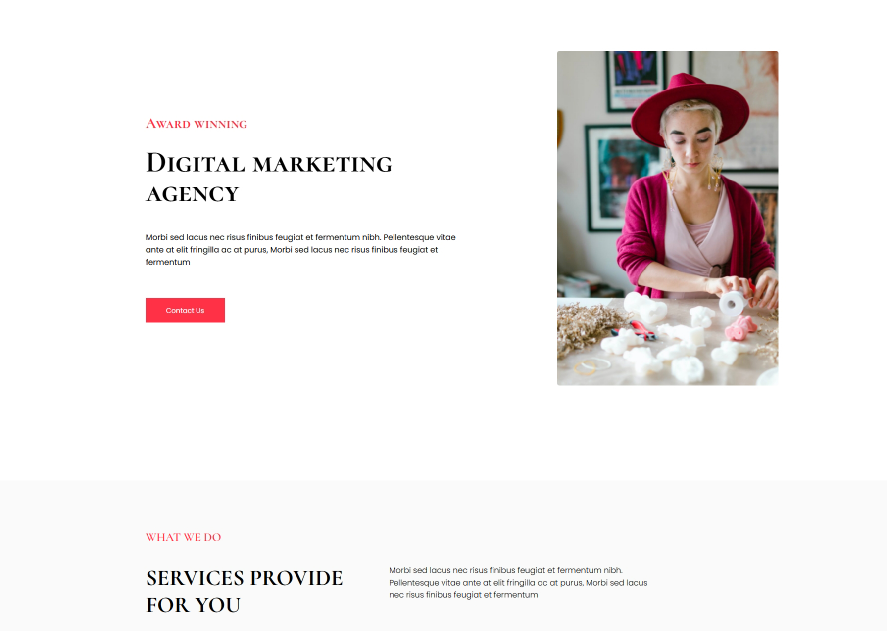
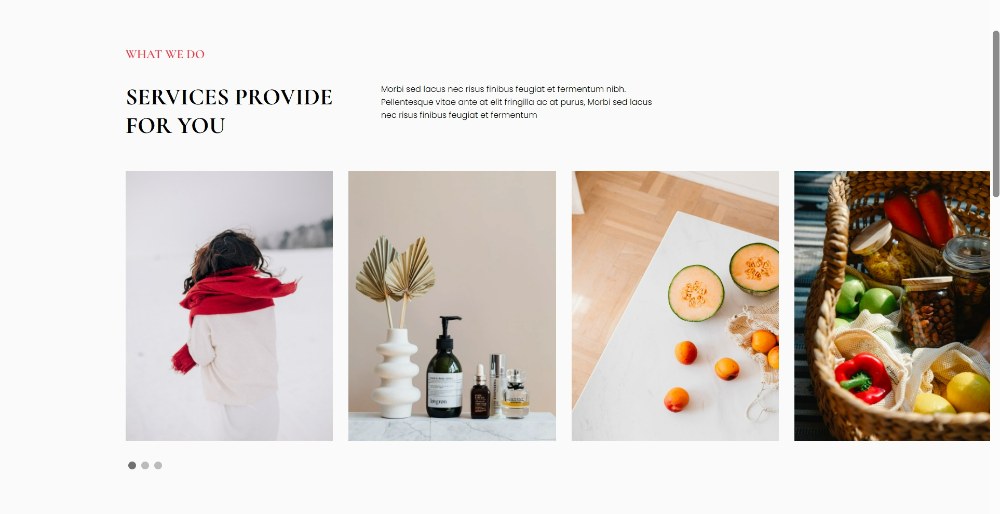
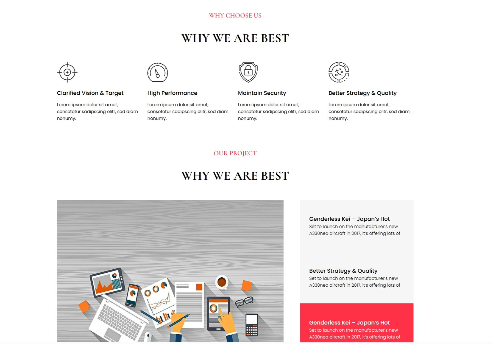
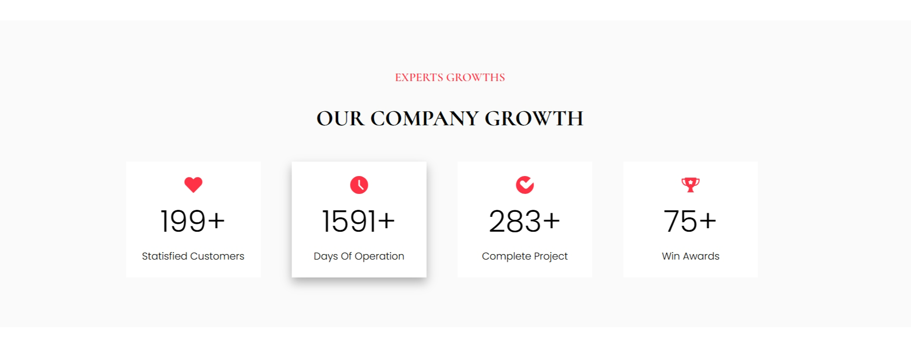
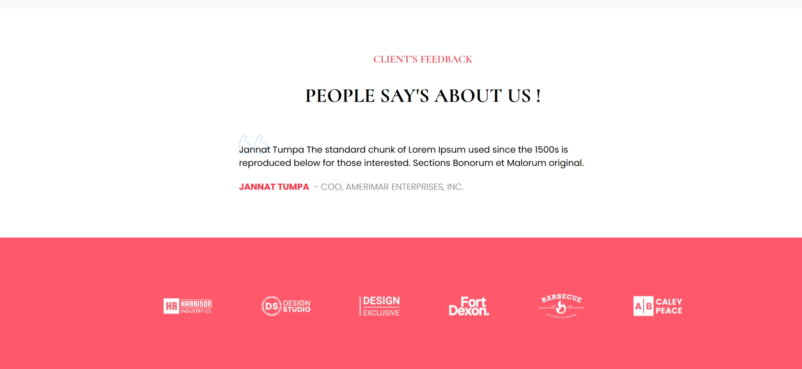

# Assignment on Digital Marketing agency

## Some key highlights

-   I have used CSS Grid in order to achive the layout of the application.
-   For styling purpose i have used css, and CSS pre-processor SASS.
-   For making some responsive element work, I have used Vanilla JavaScript.
-   One of the most interesting part in designing the whole site is designing the slider in the services section.
-   And after that, the popup form part.
-   I have given proper folder structure for writing css, which will make the code more readable.
-   The website is also responsive too, with the help of CSS Grid and Media queries.

### Attesting some screen-shots over here.

    
